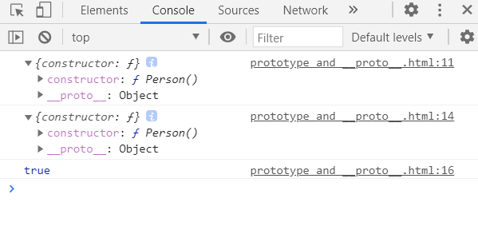

内容参考：[原型、原型链](https://www.bilibili.com/video/BV1ci4y157Ci)


## 1. 对应名称和从属关系：

* `prototype`: 即原型，是函数的一个属性，本身是一个对象{}

* `__proto__`: 即原型链（链接点），即对象 Object 的一个属性，本身也是一个对象{}

* **对象的 `__proto__` 保存着该对象的构造函数的 `prototype`**


**example**

```html
<!DOCTYPE html>
<html lang="en">
  <head>
    <meta charset="UTF-8" />
    <meta name="viewport" content="width=device-width, initial-scale=1.0" />
    <title>Document</title>
  </head>
  <body>
    <script>
      function Person() {}
      console.log(Person.prototype)

      const person1 = new Person()
      console.log(person1.__proto__)
      // 实例对象的 __proto__ === 构造函数的 prototype
      console.log(Person.prototype === person1.__proto__) // true
    </script>
  </body>
</html>

```

如上，我们声明一个构造函数 `Person`，打印出 `Person` 的 `prototype` 属性。接着，我们创建一个 `Person` 的实例对象 `person1`，打印出 `person1` 的 `__proto__` 属性。最后，我们对两者进行 === 比较。

输出结果如下图所示：



因为构造函数的原型 `Person.prototype` 也是一个对象，对象都有 `__proto__` 属性，则

```javascript
// 所有函数的 prototype 都默认是 Object 的实例（Object除外）
console.log(Person.prototype.__proto__ === Object.prototype) // true
console.log(Object.prototype.__proto__) // null，原型链顶端为 null
```


## 2. 认识原型链、原型与原型链继承

给实例对象、构造函数的原型和 Object 的原型各添加属性 a、b 和 c。而通过 `person1` 我们可以访问到这些属性。

```javascript
function Person() {}
const person1 = new Person()

person1.a = 1
Person.prototype.b = 2
Object.prototype.c = 3

console.log(person1.a); // 1
console.log(person1.b); // 2
console.log(person1.c); // 3

```

我们用下面这种形式来表示上边展示的代码，可以看出，如果我们在自身找不到需要的属性，那么它会自动在链上往上找。这就是原型链：

```javascript
      // person1 {
      //   a: 1,
      //   __proto__: Person.prototype = {
      //     b: 2,
      //     __proto__: Object.prototype = {
      //       c: 3,
      //       __proto__: null
      //     } 
      //   }
      // }
```


## 3. Function 和 Object 的特殊性

```javascript
// const Person = new Function() 
// 构造函数 Person 是由 Function 创建出来的
console.log(Person.__proto__ === Function.prototype) // true
console.log(Function.__proto__ === Function.prototype) // true（这是规定）
// const obj = new Object()
console.log(typeof Object) // function
console.log(Object.__proto__ === Function.prototype) // true
// 由前面代码推导可知：
console.log(Object.__proto__ === Function.__proto__) // true

```


## 4. 判断属性是否存在的方法

**属性只在自身存在**：

```javascript
console.log(person1.hasOwnProperty('a')) // true
console.log(person1.hasOwnProperty('b')) // false
console.log(person1.hasOwnProperty('c')) // false
```

**属性在链上存在**：

```javascript
console.log('a' in person1) // true
console.log('b' in person1) // true
console.log('c' in person1) // true
```


